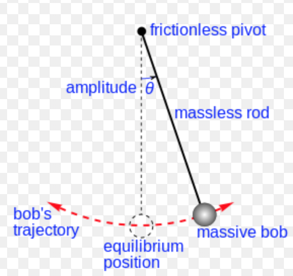
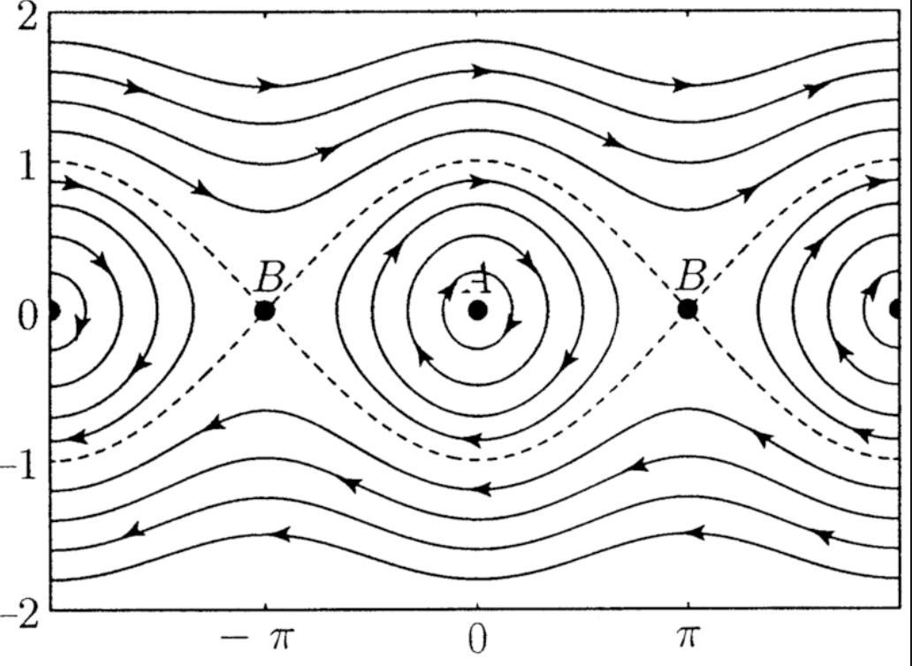

# Dinamica No Lineal - Practica

## Sistema Dinamico

### Que es un sistema dinamico?

Un sistema dinamico es un conjunto de reglas que determinan la evolucion temporal del problema. En particular para nosotros, van a ser en principio:

  * Sistema de ODEs de 1er.

##### Ejemplo: Ecuación del péndulo

$$ml^2 \ddot{\theta} = -m g l \sin{\theta}$$

$$\ddot{\theta} + \frac{g}{l} \sin{\theta} = 0$$

Una ecuacion de segundo orden, que la llevo a 2 de primer orden.

$$\dot{\theta} = \Omega$$

$$\dot{\Omega} = - \frac{g}{l} \sin{\theta}$$

Cuando el sistema dinamico no depende explicitamente del tiempo se lo llama `AUTONOMO`.

Se llama `CAMPO VECTOR` a $\vec{f}(\vec{x}) /$

$$\begin{pmatrix} \dot{\theta} \\  \dot{\Omega} \end{pmatrix} = \begin{pmatrix} \Omega \\ - \frac{g}{l} \sin{\theta} \end{pmatrix} $$

`TRAYECTORIA`: Va a describir que le pasa a las variables con las que describo el problema en el tiempo en el espacio de fases dada una condicion inicial. Las trayectorias en el espacio de fases NO SE CRUZAN.

`RETRATO DE FASES`: Cuando dibujo muchas trayectorias en el espacio de fases tal que consigo una idea de las posibles soluciones de mi sistema dinamico logro un retrato de fases.

`PUNTO FIJO`: Aquel punto en el espacio de fases tal que se anula el campo vector. Simbolicamente,

$$\vec{x}^* / \vec{f}(\vec{x}^* ) = 0$$

-----

### Sistema lineal

##### Ejemplito bobina.

$$\dot{x} = a x$$

$$\frac{dx}{x} = a dt$$

$$\ln(x) = a t$$

$$x(t) = A e^{at}$$

Vemos que este ejemplo tiene un punto fijo en el 0, y se tiene que las soluciones se "caen" o se "alejan" del punto fijo, dependiendo de si $a < 0$ o $a > 0$. Linealizar alrededor de un punto fijo da la idea de si el sistema va a tender al punto fijo o salir expulsado del mismo.

##### Ejemplos no lineales

###### Modelo de poblacion

$$\dot{N} = aN(1 - \frac{N}{k})$$

###### Ley de Gompertz

$$\dot{N} = -aN\ln(bN)$$

Masomenos lo mismo que el modelo de poblacion, solo que la capacidad de carga esta puesta de otra manera. Para solucionar, hay que hacer 2 cosas:

  * Encontrar los puntos fijos.
  * Entender el campo vector.

A ojo: Cuando N es muy chico, $\dot{N} > 0$. Cuando N es muy grande, $\dot{N} < 0$.

`Puntos fijos`: Tenemos que $\dot{N} = 0$ cuando:

  * $N = 0$
  * $N = \frac{1}{b}$

Que pasa en la cercania de los puntos fijos? Taylor alrededor de $\vec{f}(x - x^* )$

$$f(x^* + \chi) = \cancel{f(x^* )} + f^{'}\mid_{x^* } \chi + f^{''}\mid_{x^* } \frac{\chi^2}{2} + ...$$

Para nuestro caso particular:

$$N^* = \frac{1}{b}, \;\; \;f^{'}(N^* ) = -a < 0$$

Por lo tanto sabemos que la perturbacion en el tiempo se va a achicar, por lo que tiende a quedarse en el punto.

Ademas, hay que tener en cuenta que como las trayectorias son unicas, no se puede oscilar. Se tiende infinitiamente al punto fijo que corresponda, en particular para este caso siempre a $N = \frac{1}{b}$, salvo que la condicion inicial sea $N = 0$.

**Con esto, deberia alcanzar para hacer la guia.**

Antes, tener en cuenta que para el ejercicio 8 hay que tomar:
  a. $\mu = 1$
  b. $\mu = 2$
  c. $\mu = 2$

-----

### Flujos en el circulo

Esta es una manera de poder describir oscilaciones sin aumentar la dimensionalidad (recordamos que en problemas unidimensionales no se puede oscilar ya que las trayectorias no se pueden cruzar). Son ejemplos en 1d pero con variables angulares.

$$\dot{\theta} = \omega$$

---

#### Ejercicio 8

**a.** $\dot{\theta} = \sin \theta - \sin{2 \theta}$

Tengo 3 opciones:

  * **Analitica**: Resolver para encontrar $\theta^* / \dot{\theta} = 0$.
  * **Grafica**: Dibujar el campo vector.
  * **Tambien graficar, pero otra cosa**: Graficar $\sin{\theta}$ y $\sin{2\theta}$ y buscar los puntos que cumplen que $\sin{\theta} = \sin{2\theta}$. Da una idea rapida de donde estan los puntos fijos. Me puedo fijar en que rango de $\theta$ cual de las dos curvas es mayor, y me da la idea de cuando $\dot{\theta}$ es $>$ o $<$ a $0$.

---

#### Ejercicio 10: Sincronizacion de luciernagas

Tenemos muchas luciernagas, que titilan con distintas frecuencias:

* **Luciernaga 1**: $\dot{\theta} = \omega$
* **Luciernaga 2**: $\dot{\Theta} = \Omega$

Quiero ahora dar una ecuacion que describa a mi luciernaga, tal que si la luciernaga esta "atrasada", se apure, y que si esta "adelantada", se frene. Se plantea:

$$\dot{\theta} = \omega + A \sin(\Theta - \theta)$$

Sincronizacion se define como desfasaje constante, no desfasaje nulo. Desfasaje nulo es unisonia. Lo que se estudia en este problema es la evolucion del desfasaje $\phi = (\Theta - \theta)$.

$$\left\{\begin{matrix} \dot{\Theta} = \Omega \\ \dot{\theta} = \omega + A \sin(\Theta - \theta) \end{matrix}\right.$$

$$\Rightarrow \dot{\phi} = \dot{\Theta} - \dot{\theta} = \Omega - \omega - A \sin(\phi)$$

Busco "liberar" al seno, llevando mi variable dinamica a una variable adimensional. Con $\tau = A t$, vale que

$$\frac{d\phi}{d\tau} = \frac{-\Omega - \omega}{A} - \sin{\phi},$$

y definiendo $\mu = \frac{- \Omega - \omega}{A}$,

$$\Rightarrow \phi^{'} = \mu - \sin \phi$$

Entonces tenemos que los puntos fijos se van a dar para:

$$\phi^* /\phi^{'} = 0, \;\;\; \mu = \sin \phi$$

Tenemos que si:
  * Para $\mu = 0$ , tengo 2 puntos fijos,  en $0$ *atractor* y en $\pi$ *repulsor*. El atractor no solo es atractor, sino que es al unisono. Es logico, ya que si $\mu = 0 \Rightarrow \Omega = \omega$ osea que eventualmente cualquier diferencia de fases deberia achicarse. Lo mismo pasa si $A >> 1$. Para $\pi$, es repulsor, y esta exactamente en contrafase.
  * Para $0 < \mu < 1$, tenemos 2 puntos fijos, uno atractor y otro repulsor, con valores entre $0 < \phi^{* }_1 < \phi^{* }_2 < \pi $. Ademas, $\phi^{* }_1$ es *atractor* y $\phi^{* }_2$ es *repulsor*. Tenemos que aunque las frecuencias naturales de cada luciernaga son distintas, vale que se sincronizan porque una de las dos fuerza su frecuencia a que se acople a la otra.
  * Para $\mu > 1$, no hay punto fijo. Las diferencias entre las frecuencias son demasiado diferentes y no llegan a acomodarse.

$$T_{Drift} = \int dt = \int_0^{2\pi} \frac{dt}{d\phi}d\phi$$
